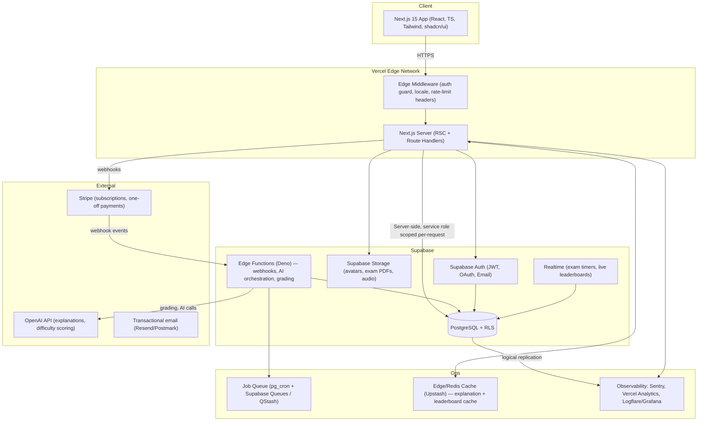
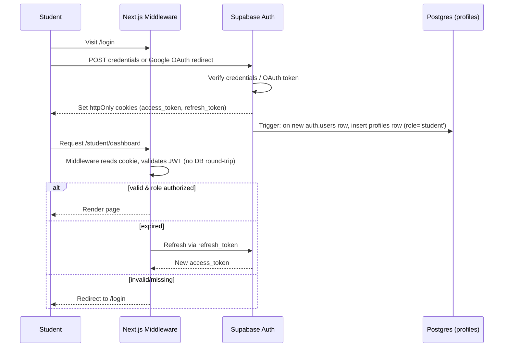
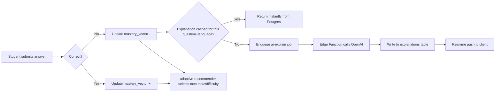

# CSCA Prep — Technical Architecture

**Product:** CSCA Prep, an exam-prep platform for the CSCA (Chinese University entrance exam for international students), operated under the Opportunities Hunter brand.
**Scale target:** 100,000+ concurrent students within 18 months.
**Status:** Architecture only — no application code yet.

---

## 1. Executive Summary

CSCA Prep gives international students realistic mock exams, adaptive practice, and AI-generated explanations for the CSCA. The system is a Next.js 15 app on Vercel backed by Supabase (Postgres, Auth, Storage, Edge Functions), with Stripe for payments and OpenAI for explanations and adaptive difficulty scoring.

Design priorities, in order:
1. **Data integrity of exam attempts** — a student's score must never be lost or corrupted, even under concurrent submissions or network drops.
2. **RLS-first security** — every row-level access decision lives in Postgres policies, not just app-layer checks, so a bug in the Next.js layer can't leak another student's data.
3. **Cost-bounded AI usage** — OpenAI calls are queued, cached, and rate-limited per user; explanations are cached per question so 100k students asking the same question costs one call, not 100k.
4. **Horizontal scalability on the read path** (mock exams, question banks) since reads vastly outnumber writes.

---

## 2. High-Level Architecture



**Key decisions**

| Decision | Rationale |
|---|---|
| Next.js Route Handlers + Server Actions, not a separate Node backend | Fewer moving parts; Supabase already provides the "backend" (DB, auth, storage, functions). Avoids maintaining two deploy targets. |
| Supabase Edge Functions for anything touching OpenAI/Stripe secrets | Keeps third-party API keys out of the Next.js server bundle/env exposed to Vercel; isolates blast radius; functions can be scaled/rate-limited independently. |
| Postgres RLS as the primary authorization layer | App-layer bugs are the #1 cause of data leaks in EdTech. RLS makes "student A reads student B's exam attempt" impossible at the database level regardless of API bugs. |
| Redis (Upstash) cache in front of hot reads | Question banks and leaderboards are read-heavy and change infrequently; caching removes >90% of DB load at 100k-user scale. |
| Async job queue for AI grading/explanations | OpenAI latency (1–10s) must never block exam submission. Submission is synchronous and instant; explanation generation is async and back-filled. |

---

## 3. Technology Stack

**Frontend**
- Next.js 15 (App Router, React Server Components, Server Actions)
- TypeScript (strict mode)
- TailwindCSS + shadcn/ui (Radix primitives)
- TanStack Query for client-side cache of mutable, non-SSR data (timers, live progress)
- Zod for schema validation shared between client forms and server actions

**Backend / Data**
- Supabase (managed Postgres 15+, Auth, Storage, Realtime, Edge Functions on Deno)
- PostgreSQL with Row Level Security on every table
- Drizzle ORM (typed schema, migrations) — chosen over the Supabase JS query builder for complex joins (exam analytics, adaptive learning queries)

**Auth**
- Supabase Auth: email/password + Google OAuth
- JWT-based sessions, short-lived access token + refresh token rotation
- Custom `profiles` table extending `auth.users` with role, plan, locale

**Payments**
- Stripe Billing (subscriptions: monthly/annual plans) + Stripe Checkout for one-off mock-exam bundles
- Stripe webhooks processed exclusively in an Edge Function, verified via signing secret

**AI**
- OpenAI API (GPT-4o class model) for: (a) generating step-by-step explanations for wrong answers, (b) tagging question difficulty/topic during content ingestion, (c) adaptive next-question selection heuristics
- Explanation responses cached per `question_id` + `language` in Postgres — the model is called once per question ever, not once per student

**Infra / Ops**
- Vercel (frontend + serverless/edge functions for Next.js)
- Upstash Redis (cache + rate limiting)
- Sentry (error tracking), Vercel Analytics + Logflare (logs/metrics)
- GitHub Actions (CI: lint, typecheck, test, migration dry-run)

---

## 4. Folder Structure

```
csca-prep/
├── apps/
│   └── web/                          # Next.js 15 app
│       ├── app/
│       │   ├── (marketing)/          # public landing pages, OH branding
│       │   ├── (auth)/               # login, signup, oauth callback
│       │   ├── (dashboard)/
│       │   │   ├── student/          # student dashboard, progress, plans
│       │   │   ├── exam/[examId]/    # exam-taking flow (timed, resumable)
│       │   │   └── results/[attemptId]/
│       │   ├── (admin)/              # role-gated admin console
│       │   │   ├── content/          # question/exam CRUD
│       │   │   ├── users/
│       │   │   └── analytics/
│       │   ├── api/                  # thin route handlers (webhooks excluded)
│       │   └── layout.tsx
│       ├── components/
│       │   ├── ui/                   # shadcn primitives
│       │   ├── exam/                 # timer, question-card, answer-sheet
│       │   └── admin/
│       ├── lib/
│       │   ├── supabase/             # server + browser client factories
│       │   ├── validation/           # zod schemas (shared client/server)
│       │   ├── auth/                 # session helpers, role guards
│       │   └── analytics/
│       ├── server/
│       │   ├── actions/              # Server Actions (mutations)
│       │   └── queries/              # cached read functions
│       └── middleware.ts             # auth guard, locale detection
│
├── packages/
│   ├── db/                           # Drizzle schema + migrations (source of truth)
│   ├── types/                        # shared TS types/DTOs
│   └── config/                       # eslint, tsconfig, tailwind presets
│
├── supabase/
│   ├── functions/
│   │   ├── stripe-webhook/
│   │   ├── ai-explain/               # OpenAI orchestration, queued
│   │   ├── ai-grade-essay/           # for free-response questions, if any
│   │   └── adaptive-recommender/
│   ├── migrations/                   # generated from packages/db
│   └── config.toml
│
├── docs/
│   ├── ARCHITECTURE.md               # this file
│   └── schema.sql                    # reference DDL
│
└── .github/workflows/                # CI pipelines
```

---

## 5. User Roles & Permissions

| Role | Scope |
|---|---|
| `student` | Own profile, own exam attempts, own progress/analytics, public question bank (attempt-time only, no answer keys exposed pre-submission). |
| `content_editor` | Create/edit questions, exams, topics, explanations. No access to student PII or billing. |
| `support` | Read-only access to a given student's account (via ticket-linked, time-boxed impersonation token) for support purposes; all access is audit-logged. |
| `admin` | Full content + user management, view aggregate analytics, cannot directly view Stripe card data (Stripe hosts that). |
| `super_admin` | Admin + role assignment, billing plan configuration, system settings. Reserved for founders/CTO-level accounts. |

Roles are stored in `profiles.role` (enum) and mirrored into the JWT via a Postgres function (`auth.jwt_role()`) so RLS policies can check `auth.jwt() ->> 'role'` without an extra query. Role changes trigger a forced token refresh.

---

## 6. Database Schema (logical overview)

Implemented across `supabase/migrations/0001`–`0007_*.sql`, which are authoritative — `docs/schema.sql` is the pre-implementation sketch, kept only as a historical record (see the note at its top for what changed). Mirrored as a typed Drizzle client in `packages/db/src/schema/*.ts`.

**Identity** (`0001_auth_foundation.sql`)
- `profiles` (1:1 with `auth.users`): `id, full_name, role, avatar_url, created_at, updated_at`. Role is `student` / `admin` / `content_manager` — a custom access token hook mirrors it into the JWT as `user_role`, which is what RLS and app-side RBAC actually check.

**Content** (`0002_content_schema.sql`)
- `subjects` → `question_categories` → `questions` → `question_options`, plus `explanations` (AI output cached per `question_id` + `language`).
- Answer-key protection: `authenticated` has no direct grant on `question_options`; the exam UI reads through `question_options_public`, a view that omits `is_correct`.

**Exams** (`0003_exam_schema.sql`)
- `exams` + `exam_questions` — curated question sets, but only for the two curated modes (`full_mock`, `daily_challenge`).
- `exam_sessions` — one row per attempt, any of the four modes from Phase 4. `subject_practice`/`difficulty_practice` are ad-hoc: `exam_id` is null and the session instead carries its own filter (`subject_id`, or a `difficulty_min`/`difficulty_max` range).
- `session_answers` — one row per question answered in a session.
- `exam_results` — computed summary (score, percentage, per-subject breakdown) written once a session is submitted; feeds Phase 6.

**Commerce** (`0004_commerce_schema.sql`)
- `subscriptions` (mirrors Stripe: `plan_tier` free/premium/premium_plus, `status`, Stripe IDs, period dates) and `payments` (one-off purchases + invoice receipts, `stripe_event_id` unique for webhook-replay idempotency). Both written only by the Stripe webhook's service-role client — there is no `profiles.plan_tier`; "current plan" is always derived from the latest active/trialing subscription row, via `current_user_plan_tier()`.

**Learning** (`0005_learning_schema.sql`)
- `courses` → `lessons` (video/pdf/notes/exercise) → `lesson_progress`. Course-level completion is a derived view (`course_progress`), not a stored column.
- `topic_mastery` (per user, per category) and `ai_recommendations` (Phase 7's generated study plans/explanations).
- `plan_tier_rank()` + `current_user_plan_tier()` implement Phase 9's "access control based on subscription" as RLS, gating `courses`/`lessons` by `required_plan_tier`.

**Gamification** (`0006_gamification_schema.sql`)
- `achievements` (badge catalog) + `user_achievements`, and `points_ledger` — an append-only event log, not a mutable points total. `leaderboard` is a view over it (joined against `profiles_public`, a safe-columns view of `profiles`, since the base table only allows self-read).

**Platform**
- `notifications` (`0007_notifications_schema.sql`) — in-app + email dispatch queue.
- `audit_logs` (support impersonation, role changes, content deletion) is deferred to Phase 8, when the admin dashboard actually implements support impersonation — no sense creating the log table before there's a feature writing to it.

**Indexing notes**
- `exam_sessions (user_id, exam_id)` for dashboard queries; partial index on `status = 'in_progress'` for O(1) "resume session" lookups even at large history.
- `session_answers (session_id)` for per-session review; `questions (category_id, difficulty)` for adaptive selection.
- `points_ledger (user_id)`, `ai_recommendations (user_id, generated_at)`, `notifications (user_id, created_at)` and a partial unread index for fast badge counts.

---

## 7. API Architecture

No separate REST API server — three layers instead:

1. **Server Actions** (co-located with pages) for authenticated mutations that don't need to be called from outside Next.js (submit answer, save progress, update profile). Type-safe end-to-end, no manual API contract to maintain.
2. **Route Handlers** (`app/api/*`) for anything needing a stable HTTP contract: Stripe/OpenAI webhooks are actually handled in Supabase Edge Functions instead (see below), but Route Handlers cover things like the mobile app (future) or third-party integrations.
3. **Supabase Edge Functions** for work that must run with elevated secrets or independent of Vercel's request lifecycle:
   - `stripe-webhook`: verifies signature, updates `subscriptions`/`payments`, idempotent via `stripe_event_id` unique constraint.
   - `ai-explain`: pulls a queued job (student answered wrong, no cached explanation exists), calls OpenAI, writes to `explanations`, notifies client via Realtime.
   - `adaptive-recommender`: nightly + on-demand batch job updating `learning_paths.mastery_vector`.

**Contract style:** internal calls use typed Server Actions (no OpenAPI needed). If/when a public API or mobile app ships, a versioned `/api/v1/*` REST surface will be added with OpenAPI spec generation — deferred until there's a second consumer, per YAGNI.

**Rate limiting:** Upstash Redis sliding-window limiter in Next.js middleware, keyed by user ID (authenticated) or IP (anonymous), tuned per route class (exam submission: strict; question bank read: generous).

---

## 8. Authentication Flow



- Email/password and Google OAuth both funnel through Supabase Auth; no custom password handling in app code.
- A Postgres trigger (`handle_new_user`) auto-creates the `profiles` row on signup — role defaults to `student`, never client-settable.
- Session cookies are `httpOnly`, `secure`, `sameSite=lax`; no tokens stored in `localStorage` (XSS mitigation).
- Role/permission checks happen twice: middleware (fast, coarse redirect) and RLS (authoritative, per-row).

---

## 9. Security Architecture

- **RLS on every table, default-deny.** Example: `exam_attempts` policy allows `SELECT/UPDATE` only where `user_id = auth.uid()`; admins get a separate policy scoped by `auth.jwt_role() = 'admin'`.
- **Answer-key protection:** `question_options.is_correct` and `questions.correct_explanation` are only ever queried server-side (Server Actions with the service role), never sent to the client until after submission — prevents devtools inspection from leaking answers mid-exam.
- **Support impersonation** is not a shared password — it's a time-boxed (15 min), single-target signed token minted by an admin action, logged to `audit_logs`, and revocable.
- **Stripe:** no card data ever touches our servers (Stripe Checkout/Elements hosted fields only); webhook signature verification is mandatory; webhook handler is idempotent.
- **OpenAI:** prompts never include another student's data; PII is stripped before sending question/answer context to the model; system prompt hardened against prompt-injection from student-submitted free-text answers (treated as data, not instructions, matching this project's own operating principle).
- **Secrets:** all third-party keys (OpenAI, Stripe, Resend) live only in Supabase Edge Function env and Vercel server-only env vars — never in `NEXT_PUBLIC_*`.
- **Input validation:** Zod schemas shared between client forms and Server Actions/Edge Functions — no trust boundary skips validation.
- **Rate limiting + WAF:** Vercel's built-in DDoS protection + Upstash rate limiter on auth and exam-submission endpoints to prevent brute-force and answer-scraping bots.
- **Dependency/security scanning:** Dependabot + `npm audit` in CI; Sentry for runtime error/security anomaly monitoring.
- **Backups:** Supabase point-in-time recovery enabled; daily logical backups exported to a separate cloud storage bucket for disaster recovery independent of the Supabase account itself.

---

## 10. Adaptive Learning & AI Pipeline



- **Cost control:** because explanations are cached per question (not per student), OpenAI spend scales with question-bank size (thousands), not user count (hundreds of thousands).
- **Adaptive difficulty:** a simple Elo-like model initially (question difficulty vs. student mastery score) — deliberately not a custom ML model for v1, to avoid over-engineering before there's usage data to train on.

---

## 11. Scalability Strategy (100k+ students)

| Concern | Mitigation |
|---|---|
| Read-heavy question bank access | Redis cache (Upstash) in front of Postgres for published exams/questions; CDN caching for static exam assets via Vercel. |
| Connection exhaustion under load | Supabase's pooled connection (PgBouncer, transaction mode) for all serverless function connections. |
| Hot rows during high-concurrency exam windows (e.g. scheduled mock exam start) | Exam attempts insert is a single-row insert keyed by `(user_id, exam_id)` unique constraint — no shared counter/lock contention. Timer state is client-computed from `started_at` + `time_limit_seconds`, not server-polled. |
| AI cost/latency spikes | Async queue (never inline with exam submission); per-user and global rate limits on `ai-explain` invocations. |
| Vercel function cold starts at scale | Next.js Route Handlers/Server Actions on Vercel's Node/Edge runtime with appropriate `runtime` selection per route; static/ISR for marketing and published exam metadata pages. |
| Database growth (attempt history) | Partition `attempt_answers`/`exam_attempts` by month once volume warrants it (deferred until metrics show need — premature partitioning adds ops overhead without current benefit). |
| Read replica need | Supabase read replicas for the admin analytics dashboard once it competes with production OLTP traffic. |

---

## 12. Deployment Strategy

- **Environments:** `local` → `preview` (Vercel PR previews, ephemeral Supabase branch DB) → `staging` → `production`.
- **CI (GitHub Actions):** lint → typecheck → unit tests → Drizzle migration dry-run against a throwaway Postgres → build. Merge to `main` auto-deploys to staging; production deploy is a manual promotion (protected environment + required approval).
- **Migrations:** hand-written SQL in `supabase/migrations/`, applied via Supabase CLI in CI before the app deploy — never applied by hand in production. This is a refinement made during Phase 1 implementation: RLS policies, triggers, and the custom access token hook aren't expressible in Drizzle's schema DSL, so raw SQL is the single source of truth for schema. Drizzle (`packages/db`) is a typed *query* client only, with `src/schema/*.ts` hand-maintained to mirror the SQL — reconciled with `drizzle-kit introspect` when they drift, never used to generate migrations.
- **Feature flags:** simple `plan_tier`/`role`-gated flags in `profiles` for now; a dedicated flag service (e.g. GrowthBook) is deferred until there's a concrete need for gradual rollouts.
- **Rollback:** Vercel instant rollback to prior deployment; DB migrations written to be backward-compatible for one release (expand/contract pattern) so a frontend rollback never breaks against a newer schema.

---

## 13. Development Roadmap

**Phase 0 — Foundations (weeks 1–2)**
Repo scaffold, Supabase project, auth (email + Google), base RLS policies, CI pipeline, design system (shadcn setup with Opportunities Hunter branding/theme).

**Phase 1 — MVP (weeks 3–8)**
Question bank + exam CRUD (admin), student exam-taking flow (timed, resumable), scoring, results dashboard, Stripe subscription checkout, cached AI explanations (synchronous call acceptable at low volume).

**Phase 2 — Adaptive + Scale-readiness (weeks 9–14)**
Async AI queue, mastery-vector adaptive recommender, Redis caching layer, load testing to 10k concurrent, audit logging, support impersonation tooling.

**Phase 3 — Beta launch (weeks 15–18)**
Real user cohort, observability (Sentry/Logflare) dashboards, rate limiting hardened, backup/DR drill, content team tooling for bulk question import.

**Phase 4 — Scale to 100k (post-launch, ongoing)**
Read replicas, table partitioning if/when metrics justify it, mobile app API surface, multi-language content expansion, admin analytics warehouse (dbt + a read replica or dedicated analytics DB).

---

## Open questions for product/CTO sign-off

1. Free-response (essay-type) questions: is AI auto-grading required for v1, or MCQ-only mock exams first?
2. Multi-language scope at launch (English + Chinese only, or broader)?
3. Any regulatory constraint on storing student PII from certain countries (data residency)?
4. Expected concurrent-exam-start scenario (e.g. a scheduled "exam day" with thousands starting simultaneously) — this shapes how aggressively we need Phase 2's load work pulled forward.
